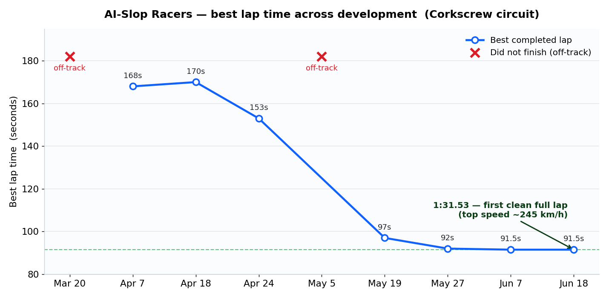
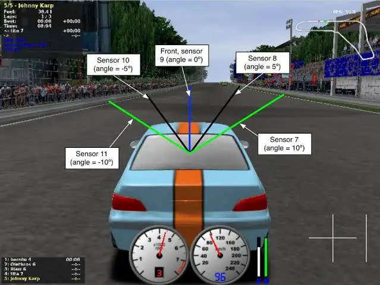
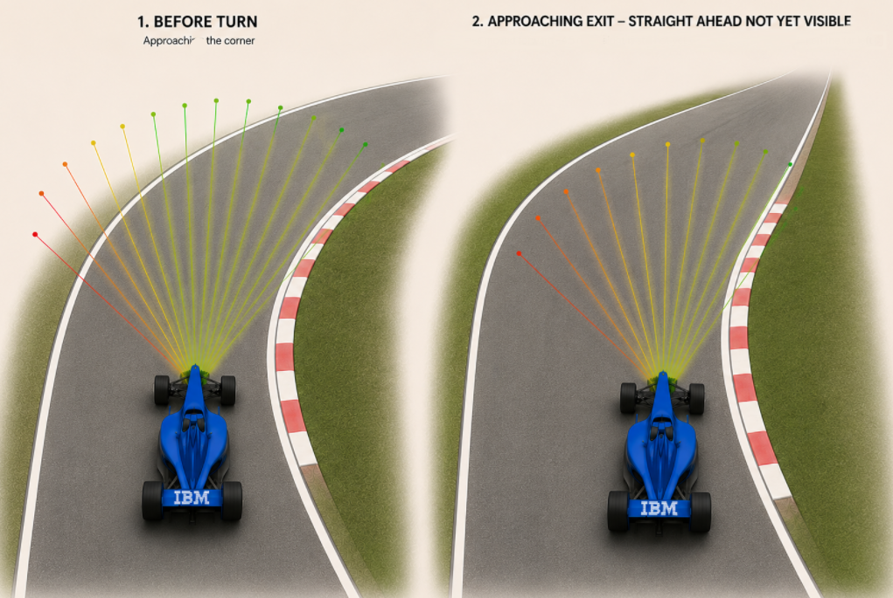
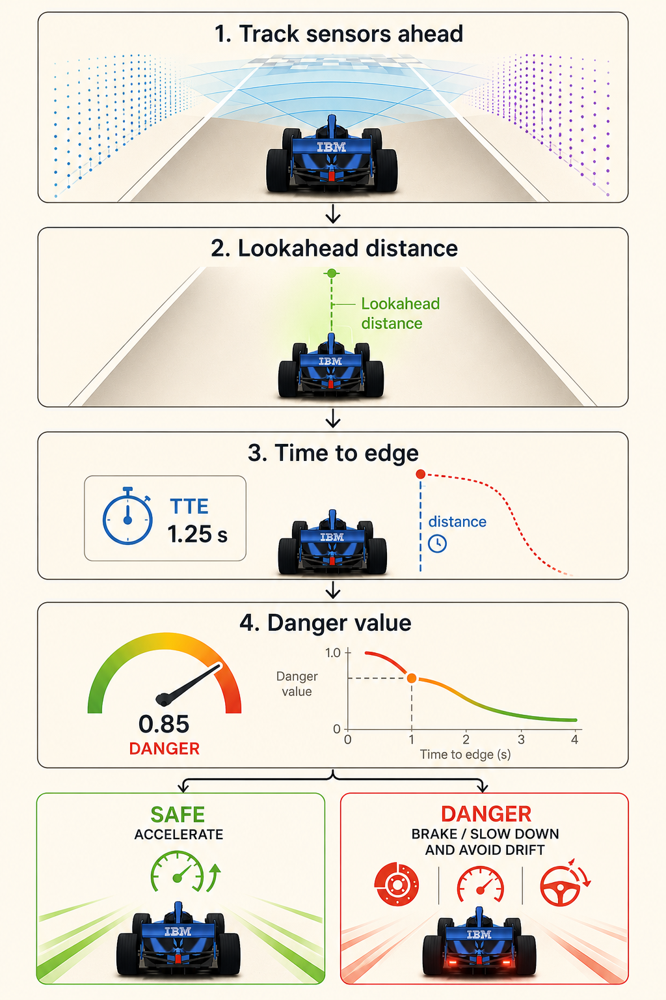
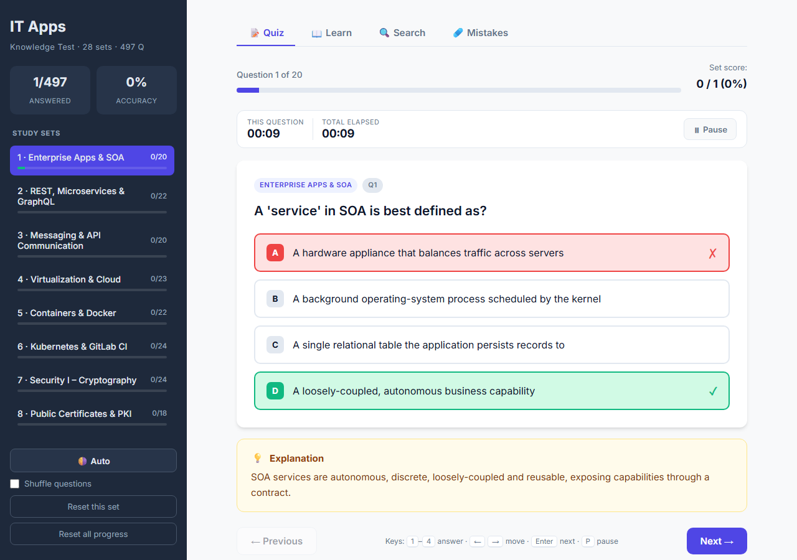
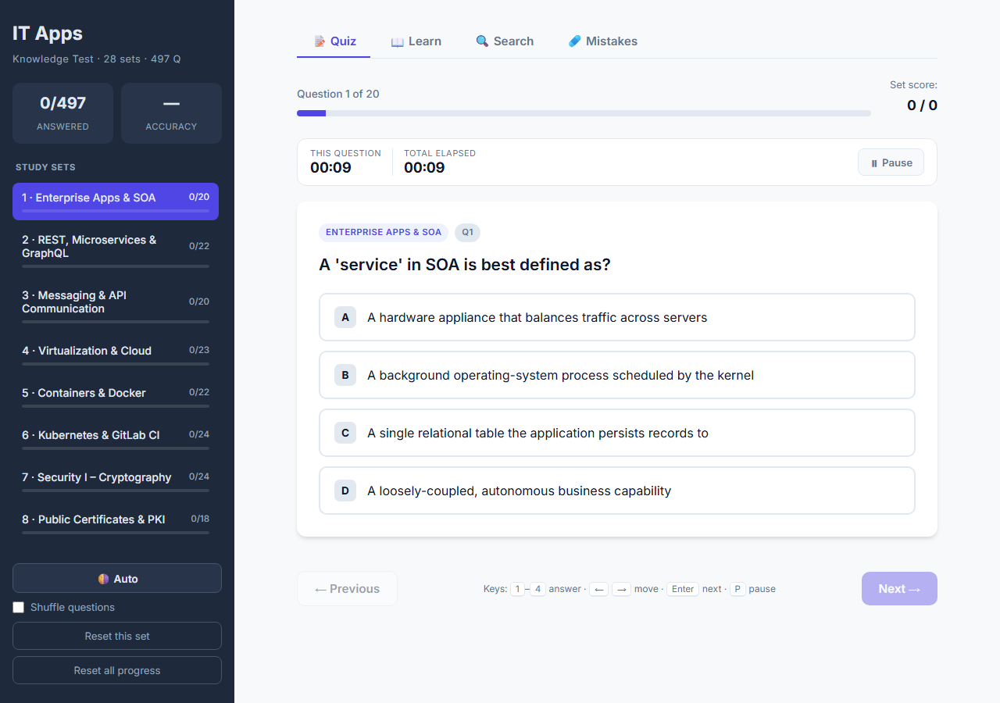
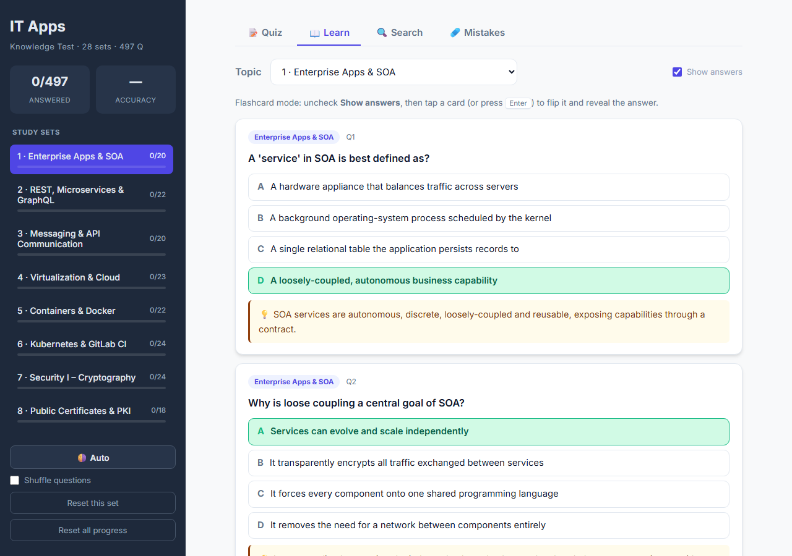
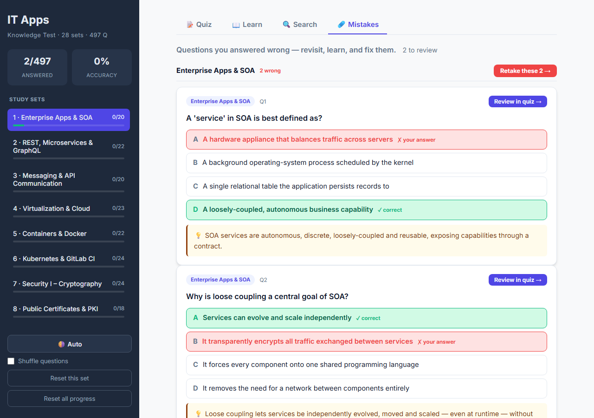

# IT Applications in Business and Commerce

[](LICENSE)
[](#license)

Coursework for the **IT Applications in Business and Commerce** course (Electronic Media in
Business and Commerce, Wrocław University of Science and Technology / Politechnika Wrocławska,
2026). Two deliverables sit side by side: a **semester team project** — a reinforcement-learning
race driver built for the IBM AI Racing League — and a **lecture study app** that turns the whole
syllabus into an interactive quiz.

> **Start here.** This page is the guided tour. Each part is self-contained and carries its own
> detailed README — open the folder for the deep dive.

| Part | What it is | Built with |
|------|-----------|-----------|
| [**project**](project/) | **AI Racer** — a PPO agent that learns to drive in TORCS for the **IBM AI Racing League**. Two included agents, full team documentation, and per-branch reports. | Python · PyTorch · TORCS (SCR UDP) |
| [**lecture/exam_prep**](lecture/exam_prep/) | **IT Apps Knowledge Test** — a client-side quiz app: 497 questions, flashcards, search, mistakes tracker. No build, opens in a browser. | Vanilla HTML · CSS · JS |

---

## The project — AI Racer (IBM AI Racing League)

A team of students — **“AI-Slop Racers”** — trained an autonomous agent with **Proximal Policy
Optimisation** to race a car in **TORCS** over the SCR UDP protocol, built with the help of IBM.
Development ran as a set of experiment branches — speed, stability, gearing, scalable
infrastructure, and an advanced racing-line architecture — that converged on one agent able to
put a clean lap together.

**The headline:** the `stable` agent completes a full, clean lap of the **Corkscrew** circuit in
**1:31.53** at ≈ 245 km/h, solving the tight S-curve that blocked every earlier attempt.



<table>
  <tr>
    <td width="33%" valign="top">
      
      <br><sub><b>Track sensors.</b> The rangefinder inputs (angles labelled) the PPO agent reads every step.</sub>
    </td>
    <td width="33%" valign="top">
      
      <br><sub><b>The Corkscrew S-curve.</b> The tight sequence that blocked every early agent — and the line the stable agent takes through it.</sub>
    </td>
    <td width="33%" valign="top">
      
      <br><sub><b>Danger-based braking.</b> The reward that learns when to lift and brake before a corner.</sub>
    </td>
  </tr>
</table>

The [project README](project/) tells the whole story — the competition, the full team and who
did what, how the danger-based braking reward works, the S-curve, and the results. It ships **two
agents** (`stable`, the best; and `a.bhuiyan`, the racing-line architecture), the **25-page
documentation**, the **per-branch technical reports** for every experiment, and the presentations.

Full write-up: **[project/README.md](project/README.md)**.

---

## The lecture app — IT Apps Knowledge Test

A single-page study app for the course lectures: **497 questions across 28 topic sets**
(enterprise apps & SOA, REST/microservices, cloud & virtualization, containers, Kubernetes,
cryptography, PKI, and more), with immediate feedback and explanations, flashcards, full-text
search, and a mistakes tracker. It's plain HTML/CSS/JavaScript — no build, no server — so you
just open `index.html`.



<table>
  <tr>
    <td width="33%" valign="top">
      
      <br><sub><b>Home.</b> Pick from 497 questions across 28 topic sets.</sub>
    </td>
    <td width="33%" valign="top">
      
      <br><sub><b>Learn mode.</b> Read each answer with its explanation before testing yourself.</sub>
    </td>
    <td width="33%" valign="top">
      
      <br><sub><b>Mistakes tracker.</b> Everything you got wrong, collected to drill again.</sub>
    </td>
  </tr>
</table>

Full write-up: **[lecture/exam_prep/README.md](lecture/exam_prep/README.md)**.

---

## Repository layout

```text
.
├── project/                AI Racer — the IBM AI Racing League project
│   ├── code/               the two included agents (stable — best result, and a.bhuiyan)
│   ├── docs/               25-page documentation, per-branch reports, figures
│   ├── competition/        IBM AI Racing League framework + posters
│   └── presentations/      kick-off and prototype decks
├── lecture/
│   └── exam_prep/          the IT Apps Knowledge Test quiz app
├── LICENSE                 MIT
└── README.md               you are here
```

---

## Credits

IT Applications (Electronic Media) in Business and Commerce · Wrocław University of Science and
Technology, 2026. The AI Racer project was built by team **AI-Slop Racers** with the help of IBM
(IBM AI Racing League); contributors and their roles are credited in the
[project README](project/README.md#the-team). It builds on **TORCS**, the **SCR** protocol, and
the **gym_torcs** wrapper (MIT © 2016 Naoto Yoshida), whose licences are preserved in the code.

---

## License

Released under the [MIT License](LICENSE) — open source and free to use. You may use, copy,
modify, and redistribute everything in this repository for any purpose, including commercially;
the only condition is to keep the copyright and licence notice. Third-party components (TORCS,
the SCR protocol, and the upstream `gym_torcs` wrapper) retain their own licences, noted where
they appear.
