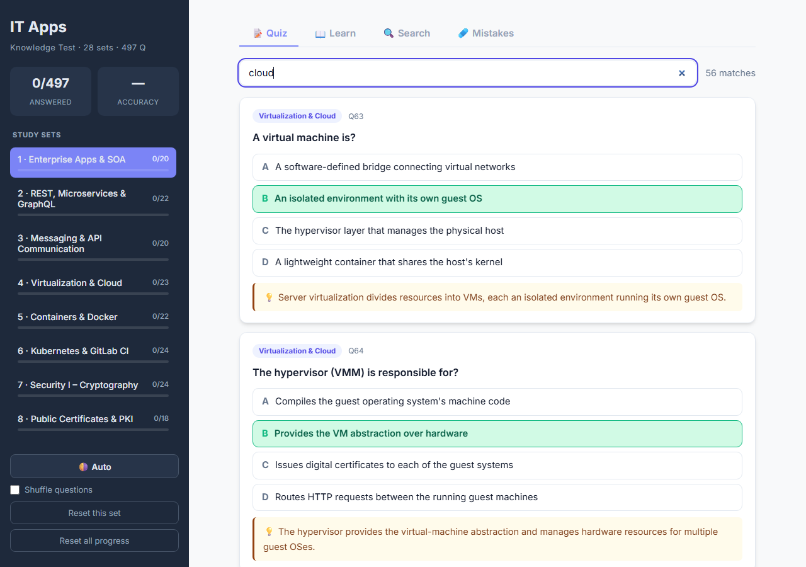
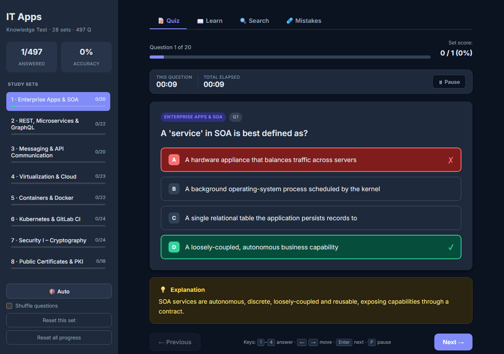

# IT Apps Knowledge Test — exam-prep quiz

[](../../LICENSE)
[](../../README.md#license)


A single-page, client-side study app for the **IT Applications in Business and Commerce**
course (Wrocław University of Science and Technology / Politechnika Wrocławska). It runs the
whole question bank in the browser: multiple-choice quizzing with **immediate feedback and
explanations**, flashcards, full-text search, and a mistakes tracker — all persisted locally
so you can close the tab and pick up where you left off.

**No build, no server, no backend.** Plain HTML, CSS, and vanilla JavaScript. Just open
`index.html`.


---

## What's inside

- **497 questions across 28 topic sets**, in two groups:
  - **20 study sets** — the core concepts, framed as things a practitioner should know
    (Enterprise Apps & SOA, REST/Microservices/GraphQL, messaging & APIs, virtualization &
    cloud, containers & Docker, Kubernetes & CI, cryptography, PKI, and more).
  - **8 *Testownik* sets** — past-exam questions, de-duplicated and cleaned into one
    well-formed question per concept.
- **Four ways to study** — Quiz, Learn (flashcards), Search, and Mistakes.
- **Answer, then learn.** Every question reveals *why* the answer is right the moment you pick.

---

## Four views

### Quiz — answer with instant feedback
Pick an option and the app immediately marks it, highlights the correct answer, and shows the
explanation. A per-question and total **study timer** (pause with `P`) keeps status visible
without pressure, and progress is saved per set so you resume where you stopped.


### Learn — flashcards
Flip through any topic (or all topics at once) as flashcards. Leave **Show answers** on to read
straight through, or turn it off for flip-card mode — tap a card (or press `Enter`) to reveal.


### Search — across everything
Type two or more characters to filter **every question, answer, and explanation** at once,
with the matches highlighted. Handy for finding "that one question about the hypervisor".



### Mistakes — fix what you got wrong
Every wrong answer in your saved progress is collected here, each card showing your choice
against the correct one, with a **Review in quiz →** jump-back and a **Retake these** drill.


---

## Nice touches

| | |
|---|---|
| **Light / dark / auto theme** | Cycles from the sidebar; `auto` follows your OS. |
| **Shuffle** | Randomise question order per set (Fisher–Yates). |
| **Keyboard-first** | `1`–`4` / `A`–`D` answer · `←` `→` move · `Enter` next · `P` pause. |
| **Resume anywhere** | Progress, per-set position, and theme persist in `localStorage`. |
| **Retry incorrect** | Re-drill just the questions you missed, with a fresh timer. |



---

## Run it

Just open the file:

```sh
# double-click index.html, or:
start index.html        # Windows
```

Or serve it (only needed if your browser blocks `file://` script loading):

```sh
python -m http.server 8000   # then open http://localhost:8000
```

The only external resource is the Inter web font; with no internet the app falls back to a
system font and works exactly the same.

---

## How it's built

Three files load in order from `index.html`:

| File | Role |
|------|------|
| `chapters.js` | The whole question bank as one global `quizData` object. **Generated — do not hand-edit.** |
| `app.js` | All logic. A single `state` object drives four views; every score is *derived* from your answers (no counters to desync). Progress persists to `localStorage` (tagged with a version so a changed bank resets stale saves cleanly). |
| `styles.css` | Design tokens in `:root`; CSS-grid sidebar + main layout; answer states via `.correct` / `.incorrect` classes. |

### Editing the question bank

`chapters.js` is **regenerated**, so edit the sources instead and rebuild:

```sh
# study questions  -> edit chapters.backup.js
# exam questions   -> edit the EXAM array in _build_bank.js
node _build_bank.js      # regenerates chapters.js (reassigns ids, de-biases option order)
node qa_test.js          # headless test harness — run after any change
```

`_build_bank.js` de-duplicates and cleans the past-exam items (the raw source repeated some
concepts up to six times and had a few wrong keys) into one well-formed question each, and
shuffles option order so answers aren't guessable by position. `qa_test.js` drives the real
event handlers through a tiny DOM shim and checks rendering, answering, cross-set navigation,
search escaping, keyboard guarding, and reset.

---

## License

Released under the [MIT License](../../LICENSE) — open source and free to use. Part of the
[IT Applications in Business and Commerce](../../README.md) coursework repository.
