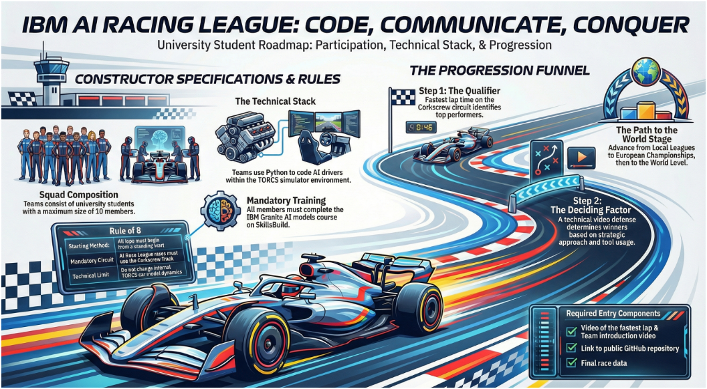

# AI Racer — a Reinforcement-Learning driver for TORCS

**IBM AI Racing League · Country Challenge 2026 — Team “AI-Slop Racers”**

[](../LICENSE)
[](../README.md#license)


An autonomous driving agent that **learns to race in [TORCS](https://sourceforge.net/projects/torcs/)**
(The Open Racing Car Simulator) using deep reinforcement learning. The agent is trained with
**Proximal Policy Optimisation (PPO)** in **PyTorch** on a compact, sensor-only state, and talks
to TORCS over the **Simulated Car Racing (SCR)** UDP protocol. Built for the IBM AI Racing
League, with assistance from IBM.

> **Headline result.** On the [`stable`](code/stable/) branch the agent completes a full, clean
> lap of the **Corkscrew** circuit in **1:31.53** at a top speed of **≈ 245 km/h** — clearing the
> tight S-curve that had been the project's central obstacle throughout development.



---

## Contents

- [The competition](#the-competition)
- [The team](#the-team)
- [What the agent sees, and how it drives](#what-the-agent-sees-and-how-it-drives)
- [The idea that cracked it — a danger-based braking reward](#the-idea-that-cracked-it--a-danger-based-braking-reward)
- [The S-curve — the central obstacle](#the-s-curve--the-central-obstacle)
- [Results](#results)
- [What's in this folder](#whats-in-this-folder)
- [The two included branches](#the-two-included-branches)
- [Running it](#running-it)
- [Credits, sources & license](#credits-sources--license)

---

## The competition

The **IBM AI Racing League** frames autonomous driving as a contest: build the fastest, most
reliable simulated driver. The Country Challenge 2026 runs on a fixed rule set (IBM's “Rule of 8”):

- **One track, standing start** — every lap begins from a standstill on the **Corkscrew** circuit
  (a road course with a tight S-section and ±12 % elevation).
- **You may only change your AI Python code** — the TORCS car model, dynamics, and livery are
  fixed for the official submission.
- **IBM SkillsBuild + IBM Granite** credentials are required of the team.
- **Lap time qualifies; a team video decides the winner** — and every team must publish a
  **public GitHub repository** and a blog post describing its approach.

The full competition brief is in [`competition/`](competition/).

---

## The team

“AI-Slop Racers” — IT Applications (Electronic Media) in Business and Commerce, Wrocław
University of Science and Technology, 2026. Development followed a **branch-per-experiment**
model on a shared baseline; the table below records each member's principal contribution and
the branch(es) they authored (git history + the project documentation are the source).

| Member | Student ID | Principal contribution | Branch(es) |
|--------|:----------:|------------------------|------------|
| **Przemysław Wdowczyk** | 188980 | RL agent & core training (technical lead) — the PPO agent and network, the training loop, the split actor/critic design. Author of the best-performing agent. | `master`, [`stable`](code/stable/) |
| **Przemysław Piasecki** | 253089 | Training infrastructure & gearing — headless training, the asyncio multi-instance trainer with crash recovery, the gear/rpm power-band reward, and the resume/optimiser fixes. | `headless`, `parallel`, `piasecki/fix1` |
| **Alimuzzaman Farhan Bhuiyan** | 254736 | Advanced control architecture & analysis — an offline racing line + residual PPO, a data-driven engine model, telemetry logging with offline analysis, and self-learning corner memory. Co-led the architecture. | [`a.bhuiyan`](code/a.bhuiyan/) |
| **Szymon Borzdyński** | 264465 | Speed, cornering & reward tuning; environment setup — 160 km/h on straights, steering-stability and traction-control shaping, S-turn handling, and the port/firewall fixes. Repository owner. | `160speed`, `160speed+stablesteer`, `Reward_func_improvement` |
| **Gabriel Bekier** | 256759 | Dynamic gearing experiments — moving gear selection into the action space with a jerk-based shift reward. | `gear_strategy_max_jerk` |
| **Vadzim Kasyan** | 294503 | Project coordination, requirements & documentation — task board, milestones, the kick-off and progress presentations, and the requirements. | — |
| **Kostiantyn Slobodnyi** | 294498 | System design, integration & documentation — the architecture, module and integration diagrams, and multi-track evaluation. | — |

<sub>The kick-off roster also listed **Jakub Grzyb** (250179) among the early team. Per-branch
technical reports for every experiment above are in [`docs/branch-reports/`](docs/branch-reports/).</sub>

---

## What the agent sees, and how it drives

The agent never sees pixels. Each step it reads a **low-dimensional sensor state** from TORCS —
19 range-finder beams to the track edge, body-frame speeds, engine rpm, heading versus the track
axis, and lateral position — and outputs a **continuous steer / throttle / brake** action (gear is
either auto-selected or, in the gearing branches, learned).


Those sensors, the previous action, and per-wheel spin are flattened into a **31-element state
vector** and fed to a small **actor/critic MLP** (256×2, Tanh). The policy is trained with
**PPO + Generalised Advantage Estimation**: collect a fixed-size rollout, compute advantages,
then run several clipped-surrogate update epochs with an early stop when the KL divergence grows
too large.

**Software architecture (the pipeline):**

| Component | File | Role |
|-----------|------|------|
| SCR UDP client | `snakeoil3_gym.py` | Serialises actions / deserialises sensor telemetry over UDP. |
| Environment | `gym_torcs.py` | Gym-like wrapper: normalises observations, shapes the reward, judges termination. |
| Agent | `rl_agent.py` | PPO agent, actor/critic network, rollout buffer, checkpoint loading. |
| Drivers | `train_torcs_rl.py`, `eval_torcs_rl.py` | Training loop and deterministic evaluation. |

The **final `stable` PPO configuration**: `lr 1e-4`, `gamma 0.99`, `gae_lambda 0.95`,
`clip 0.2`, `ppo_epochs 8`, `minibatch 256`, `entropy 3e-3`, `target_kl 0.03`, `init_log_std −1.2`.

---

## The idea that cracked it — a danger-based braking reward

The hard part of racing is knowing *when to brake*. Rather than hand-code braking zones, the
`stable` agent is rewarded by a **“time-to-edge” danger signal** it computes itself from the
forward sensors: look ahead as far as the track is visible, divide by current speed to get the
time until the car would reach the edge, and turn that into a **danger value** in `[0, 1]`. High
danger → the agent is rewarded for braking; low danger (a safe, open straight) → it is rewarded
for sprinting toward the target speed. It effectively **discovers the correct braking point for
every corner on its own.**


```text
Lookahead distance   L = max( t_i )  for sensors i in a window around the centre beam
Time to edge         T = L / (speed / 3.6)          # speed in m/s
Danger value         D = clip( (R − T) / R, 0, 1 )  # R = reference time in seconds
```

This physically-motivated shaping — plus separating the actor and critic networks — is what
produced the first complete, clean lap. It is paired with a friction-limited cornering-speed
model (`v = √(R·μ·g)`) to grade a safe entry speed for a corner of radius *R*.

---

## The S-curve — the central obstacle

Almost every experiment failed in the same place: a tight reversing **S-curve** where too much
entry speed or the wrong gear sends the car wide. The winning line **sacrifices the first apex**
— staying tight and braking early, holding neutral throttle through the weight transfer over the
blind crest — so the car can commit to a **100 % throttle launch out of the final bend**.


As the car passes the apex, the side beams start to see open track toward the exit; the visible
lookahead grows, danger drops, and the agent learns it can get back on the power.

---

## Results

Lap time on Corkscrew fell from an off-track start, through ≈ 168 s of tentative laps, to a clean
**1:31.53** once the danger reward and the stable architecture came together.


Reporting only the best lap would overstate reliability, so consistency was measured over a batch
of deterministic evaluation episodes: **the agent completed the circuit in 8 of 10 runs (≈ 80 %)**,
with finished laps clustered within a few seconds of the best (mean ≈ 1:33). Both failures were
off-track excursions in the S-curve — still the hardest section.

**The experiment branches and what each showed** (full reports in
[`docs/branch-reports/`](docs/branch-reports/)):

| Branch | Result |
|--------|--------|
| `master` | Conservative baseline — speed-capped, centre-hugging, auto-gear. |
| `160speed` | Reached ≈ 140 km/h but completed only three-quarters of a lap. |
| `160speed+stablesteer` | Held ≈ 140 km/h with smoother steering; still struggled on the S-turn. |
| **`stable`** | **Full, clean lap in 1:31.53, top speed ≈ 245 km/h — the project's best result.** |
| `headless` | Stable reward + gear/rpm power-band reward; trains without a GUI. |
| `parallel` | ≈ 9× rollout throughput via asynchronous multi-instance training. |
| `gear_strategy_max_jerk` | Agent-controlled gear with a jerk-based shift reward (WIP). |
| `a.bhuiyan` | Racing-line + residual-PPO architecture; reduced but didn't eliminate S-curve errors. |

---

## What's in this folder

```text
project/
├── README.md                (you are here)
├── code/                    the two included agents (see code/README.md)
│   ├── stable/              best result — the danger-reward agent (1:31.53)
│   └── a.bhuiyan/           the racing-line + residual-PPO architecture
├── docs/
│   ├── AI_Racer_Documentation.pdf        full 25-page project report
│   ├── branch-reports/                   per-branch technical reports (every experiment)
│   ├── images/                           figures used in this README
│   └── TORCS_Windows_Troubleshooting_Guide.docx
├── competition/             IBM AI Racing League framework + posters
└── presentations/           kick-off and prototype decks
```

Two variants of the agent are included, as requested: **`stable`** (the best result) and
**`a.bhuiyan`** (the most different architecture). The per-branch reports document the *entire*
team's work, so nothing is lost by shipping only two code trees.

> **Not included:** the vendored **TORCS simulator** itself (≈ 1 GB of third-party C/C++ per
> branch). TORCS is a separate open-source project and a *prerequisite*, not part of the team's
> work — see [`code/README.md`](code/README.md) for how to obtain and connect it. The trained
> model checkpoints, the generated racing line, and the episode logs **are** included.

---

## The two included branches

- **[`code/stable/`](code/stable/) — the best agent.** Separate actor and critic networks, the
  time-to-edge danger reward, and an off-track-continue evaluation mode. This is the branch that
  completes the clean 1:31.53 lap. Checkpoints in `gym_torcs/checkpoints/`.

- **[`code/a.bhuiyan/`](code/a.bhuiyan/) — the racing-line architecture.** A fundamentally
  different control stack: an **offline minimum-curvature racing line** and a **deterministic
  baseline driver** do the known-good driving, and **PPO learns only a bounded residual
  correction** on top. Adds a data-driven engine model (`car_spec.py`), telemetry analysis
  (`analyze_telemetry.py`), and self-learning corner memory. Includes the generated line
  (`gym_torcs/lines/`) and episode logs.

See [`code/README.md`](code/README.md) for how the two relate and how to run either one.

---

## Running it

Full setup — including the TORCS prerequisite — is in **[`code/README.md`](code/README.md)**.
In short:

```bash
python -m venv RACERvenv && RACERvenv\Scripts\activate     # Windows
pip install -r code/stable/requirements.txt
# start TORCS on the SCR practice race (port 3001), then:
python code/stable/gym_torcs/eval_torcs_rl.py --model-path <checkpoint> --episodes 10 --max-steps 5000
```

---

## Credits, sources & license

- **Team AI-Slop Racers** — see [The team](#the-team). Original development repository:
  [github.com/Szymon1905/AI_racer_pytorch](https://github.com/Szymon1905/AI_racer_pytorch).
- **Built with the help of IBM** (IBM AI Racing League; IBM Granite & SkillsBuild).
- **TORCS** — The Open Racing Car Simulator (Wymann et al.) and the **SCR** protocol
  (Loiacono et al.) provide the environment. The Python environment wrapper derives from
  **gym_torcs** (MIT © 2016 Naoto Yoshida) — its upstream licence is preserved in each
  `gym_torcs/LICENSE`.
- **Methods** — PPO (Schulman et al., 2017) and GAE (Schulman et al., 2016); implemented with
  PyTorch and NumPy. Full reference list in the [project documentation](docs/AI_Racer_Documentation.pdf).

The team's own code, documentation, and figures in this repository are released under the
[MIT License](../LICENSE) — open source and free to use.
